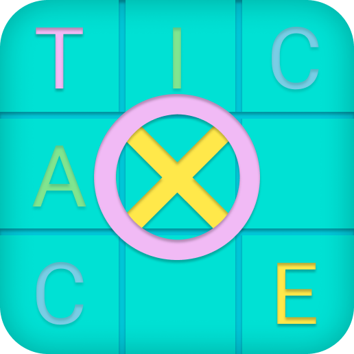

# TT Toe

A Tic Tac Toe Game, which uses AI as your opponents
Made using vanilla JavaScript

Built with 🤍 For You!

## 📃 Instructions

- Select the Game Mode
  - > Single player or Double player
- If you chose 2 players:
  - Then start playing
- If you chose 1 player: - Then select Tic or Tac - Start Playing!
  > Standard Tic Tac Toe Rules Apllied

## ⚡ Features

- Easy To play
- A tons of fun
- No login required
- Different game modes
- In-Game Audios
- A Web Browser Based Game
- Not At All Resource Heavy
- Your Scores are saved!
- Works Across All Devices
  - desktop computers
  - tablets
  - smartphones
    - iOS
    - Android

## 🔗 Links

## 🛠 Used

### Languages

- HTML
- CSS
- Javascript

### Concepts

- Local Storage
- JS Modules
- Audios
- Css FlexBox
- Css Grid
- Document Object Model
- JS objects
- Math.random
- Math.floor
- More:
  - array
  - functions
  - eventlisteners
  - etc.

### Aditional Practices

- git branches
- git merging
- root emphemeral unit (rem)
- Modules

## Screenshots

### Game Mode Selection

### Choose X-O

### Playing Screen

### Result Screen
#### Game Tied

#### O Wins

#### X Wins

